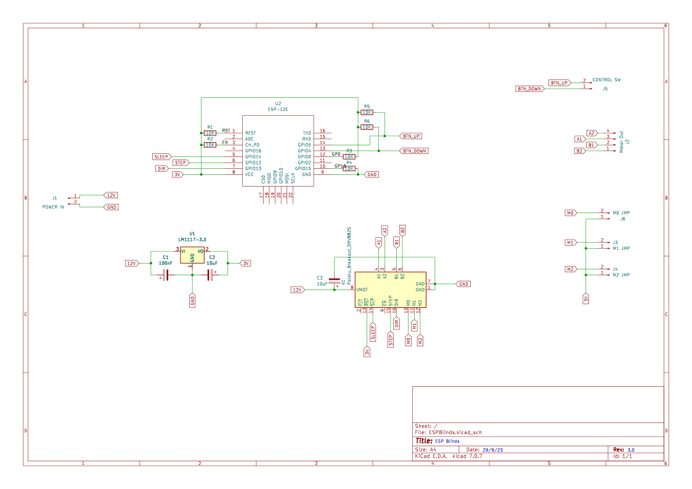

# ESPBlinds - Wifi Controlled Roller Blinds

STLs are available in the [files](files) folder in this repo, and on thingiverse at: https://www.thingiverse.com/thing:5321952

## Arduino Program
This Repo contains the Arduino program used to run the ESP-8266 controller.

The code has been tested on Arduino IDE v1.8.19 on Linux and Mac, if you have issues compiling please try using this version of the Arduino IDE.

### Constants file
**IMPORTANT: You need to create constants.h**

Copy-paste the file `constants.example.h` to `constants.h` and fill update at minimum the following variables:
 - `WIFI_SSID`
 - `WIFI_PASSWORD`
 - `MQTT_SERVER`
 - `MQTT_USER`
 - `MQTT_PASSWORD`

All MQTT topics are also defined in `constants.h`, feel free to customise these if you prefer different topic naming.

### Arduino Libraries 
Please ensure the following Arduino Libraries are installed using the Arduino Library Manager:
 - ESP8266WiFi - https://arduino-esp8266.readthedocs.io/en/latest/esp8266wifi/readme.html
 - PubSubClient -  https://www.arduino.cc/reference/en/libraries/pubsubclient/

### Compiling for ESP8266
If you are using the ESP-12F modukle as I did, use the following Board settings in Arduino IDE:
- Board: `NodeMCU 1.0 (ESP-12E)`
- Upload Speed: `115200`
- (I left all other settings as the default)

## Parts used
 - 2.8v 1.7A Stepper Driver (SY42STH38-1684A): https://www.pololu.com/product/2267
 - DRV8825 Stepper Motor Driver: https://www.pololu.com/product/2133
 - ESP8266 12-F: https://www.katranji.com/tocimages/files/423280-229082.pdf
 - 12v 2A DC Power Supply (no link - just make sure the amperage is higher than your stepper, with some room to breath to also run the ESP8266)
 - 3.3v Regulator: https://core-electronics.com.au/voltage-regulator-3-3v.html
 - M3x8mm screws (x4) for mounting the motor
 - M3x4mm screws (x4) for mounting the lid
 - 4x wood screws to mount the whole thing to the wall - you will need to decide the best screws to use based on what your wall is made out of.

...and some generic electronics components, such as capacitors and 10K resistors.

See the schematic for full details

## Mounting instructions
- First mount the enclosure to the wall. The motor covers one of the screw holes.
- Mount the stepper motor before adding the main gear - it covers access to 2 of the motor screw holes
- Then put in the main gear and everything else
- Then add on the lid!

## MQTT Topics
The unit is controlled remotely via MQTT, as I use Home Assistant and the MQTT integration for all my home automation projects.

See `constants.example.h` for all the available topics - you can also change the topic stings to whatever you want.

The topics are grouped into two types: Control and Non-Control topics. Control topics have `control` somewhere in the name, and the unit listens to these topics and does something (e.g. moves the blinds) when a message is received on the topic. Non-control topics don't have the word `control` in the them, and are used to send messages out from the unit to let the world know it's current states and settings.

### Control Topics

#### `MQTT_TOPIC_CONTROL_ENABLED`
Enables/Disables the Stepper Motor Driver - useful for emergency stopping the motor

Expected Values:
 - `0` - Disable
 - `1` - Enable

#### `MQTT_TOPIC_CONTROL_DIRECTION`
Changes the direction of the stepper motor/the direction the blinds will move

Expected Values:
 - `0` - Open/Up
 - `1` - Close/Down

#### `MQTT_TOPIC_CONTROL_STEPFOR`
Immediately move the stepper motor X *full* steps, in the currently set direction (e.g. set via `MQTT_TOPIC_CONTROL_DIRECTION`).

Expected Value: An integer for the number of steps

#### `MQTT_TOPIC_CONTROL_BLINDS`
Tell the blinds to either open or close, for the set number of steps required to complete the journey (e.g. set via `MQTT_TOPIC_CONTROL_STEPS_VERTICAL`)

Expected Values:
 - `opened` - Open the blinds
 - `closed` - Close the blinds

## Non-Control Topics

#### `MQTT_TOPIC_STATE`
Publishes the current movement state of the blinds

Expected Values:
 - `opening`
 - `opened`
 - `closing`
 - `closed`

#### `MQTT_TOPIC_STATE`
Publishes the current movement state of the blinds

Expected Values:
 - `opening`
 - `opened`
 - `closing`
 - `closed`

#### `MQTT_TOPIC_STEPS`
Publishes the current number of full steps taken (note this is only sent every 250 steps)

Expected Value: Integer

#### `MQTT_TOPIC_ENABLED`
Publishes if the stepper motor driver is currently enabled

Expected Values:
 - `0` - Not Enabled
 - `1` - Enabled

#### `MQTT_TOPIC_DIRECTION`
Publishes the current stepper motor direction

Expected Values:
 - `forwards`
 - `backwards`

#### `MQTT_TOPIC_MODE`
Publishes the current stepper motor step mode

Expected Values:
 - `1` - Full Step Mode
 - `2` - Half Step Mode
 - `4` - Quarter Step Mode
 - `8` - Eighth Step Mode

#### `MQTT_TOPIC_STATUS`
Publishes the current MQTT connection status

Expected Values:
 - `connected` - The unit is connected to MQTT
 - `disconnected` - The unit has disconnected from MQTT (this is sent as an MQTT last-will message, so it is mostly reliable)

#### `MQTT_TOPIC_MODE_OPEN`
Publishes the current step mode for the *Opening* sequence (see `MQTT_TOPIC_CONTROL_MODE_OPEN`)

Expected Values:
 - `1` - Full Step Mode
 - `2` - Half Step Mode
 - `4` - Quarter Step Mode
 - `8` - Eighth Step Mode

## Some more pics

Main gear with ball-chain gear attachment

---

Ball-chain gear attachment (another angle)

---

Control Board (with A4988 instead of DRV8255 stepper driver)

---

Housing with stepper motor and gear installed

---

Housing with stepper motorm, gears, and board installed

---

Everything ready to go, just need to put the lid on

## License
MIT - see [LICENSE.md](https://github.com/se1exin/ESPBlinds/blob/master/LICENSE.md)
